# Root Cause Analysis: Articles Not Appearing in Search Engines

## 🔍 **Root Cause Identified**

The issue is **NOT** with SEO, canonical tags, or redirects. The problem is that **articles are not being served by the API endpoints** because of a **data source mismatch**.

## 📊 **Current System Architecture**

### Two Different Data Sources:
1. **Ghost CMS** (Content Management System)
   - ✅ Contains 425+ published articles
   - ✅ Used by sitemap generation (`/sitemap.xml`)
   - ✅ Used by some endpoints like tag filtering
   - ✅ Articles are properly formatted and SEO-ready

2. **Local Database** (PostgreSQL)
   - ❌ Contains 0 articles (empty)
   - ❌ Used by main API endpoints (`/api/articles`, `/api/articles/recent`)
   - ❌ Used by frontend to display articles
   - ❌ This is why no articles show up on the website

## 🔧 **The Problem**

```mermaid
graph TD
    A[Ghost CMS - 425 Articles] --> B[Sitemap.xml - ✅ Works]
    A --> C[Some API Endpoints - ✅ Works]
    
    D[Local Database - 0 Articles] --> E[Main API Endpoints - ❌ Empty]
    E --> F[Frontend - ❌ No Articles]
    F --> G[Search Engines - ❌ Nothing to Index]
```



### Evidence:
- **Sitemap**: `curl -s "https://proximareport.com/sitemap.xml" | findstr "articles"` shows 80+ article URLs
- **API**: `curl -s "https://proximareport.com/api/articles?limit=5"` returns `{"articles":[],"pagination":{"page":1,"limit":5,"total":0,"hasMore":false}}`
- **Ghost API**: Direct test shows 425 articles available

## 🎯 **Solution Implemented**

### Fixed API Endpoints to Use Ghost CMS:

1. **Updated `/api/articles` endpoint** to fetch from Ghost instead of local database
2. **Updated `/api/articles/recent` endpoint** to fetch from Ghost instead of local database
3. **Added proper data transformation** to match expected frontend format
4. **Added fallback mechanism** to local database if Ghost fails

### Code Changes Made:

```javascript
// OLD (using empty local database):
articles = await storage.getArticles(limit, offset, showDrafts, userId);

// NEW (using Ghost CMS):
const ghostPosts = await getPosts(page, limit);
const ghostArticles = ghostPosts.posts || [];
articles = ghostArticles.map((post) => ({
  id: parseInt(post.id) || 0,
  title: post.title,
  slug: post.slug,
  summary: post.excerpt || post.custom_excerpt || '',
  // ... proper transformation
}));
```

## 🚀 **Expected Results After Deployment**

1. **Frontend will display articles** - API will return actual articles from Ghost
2. **Search engines will find articles** - They'll be properly served and indexable
3. **SEO will work** - Articles already have proper meta tags and structured data
4. **Sitemap consistency** - All endpoints will use the same data source

## 📋 **Deployment Required**

The changes are ready but need to be deployed to production:

### Files Modified:
- `server/routes.ts` - Updated articles API endpoints
- `test-ghost-connection.js` - Verification script (can be deleted after deployment)

### Verification Commands:
```bash
# After deployment, these should return articles:
curl "https://proximareport.com/api/articles?limit=5"
curl "https://proximareport.com/api/articles/recent?limit=5"
```

## 🔍 **Why This Wasn't Obvious Initially**

1. **Sitemap looked correct** - It was using Ghost CMS
2. **SEO implementation was correct** - Articles have proper meta tags
3. **No obvious errors** - API returned valid JSON, just empty
4. **Mixed data sources** - Some endpoints used Ghost, others used local DB

## ✅ **Next Steps**

1. **Deploy the changes** to production
2. **Verify API endpoints** return articles
3. **Test frontend** displays articles
4. **Request re-indexing** in Google Search Console
5. **Monitor search engine indexing** over next 7-14 days

## 📈 **Impact**

- **Before**: 0 articles visible to search engines
- **After**: 425+ articles available for indexing
- **SEO Impact**: Massive improvement in search engine visibility
- **User Experience**: Articles will actually appear on the website

This fix addresses the fundamental issue preventing search engine indexing and will have immediate positive impact on SEO performance.
